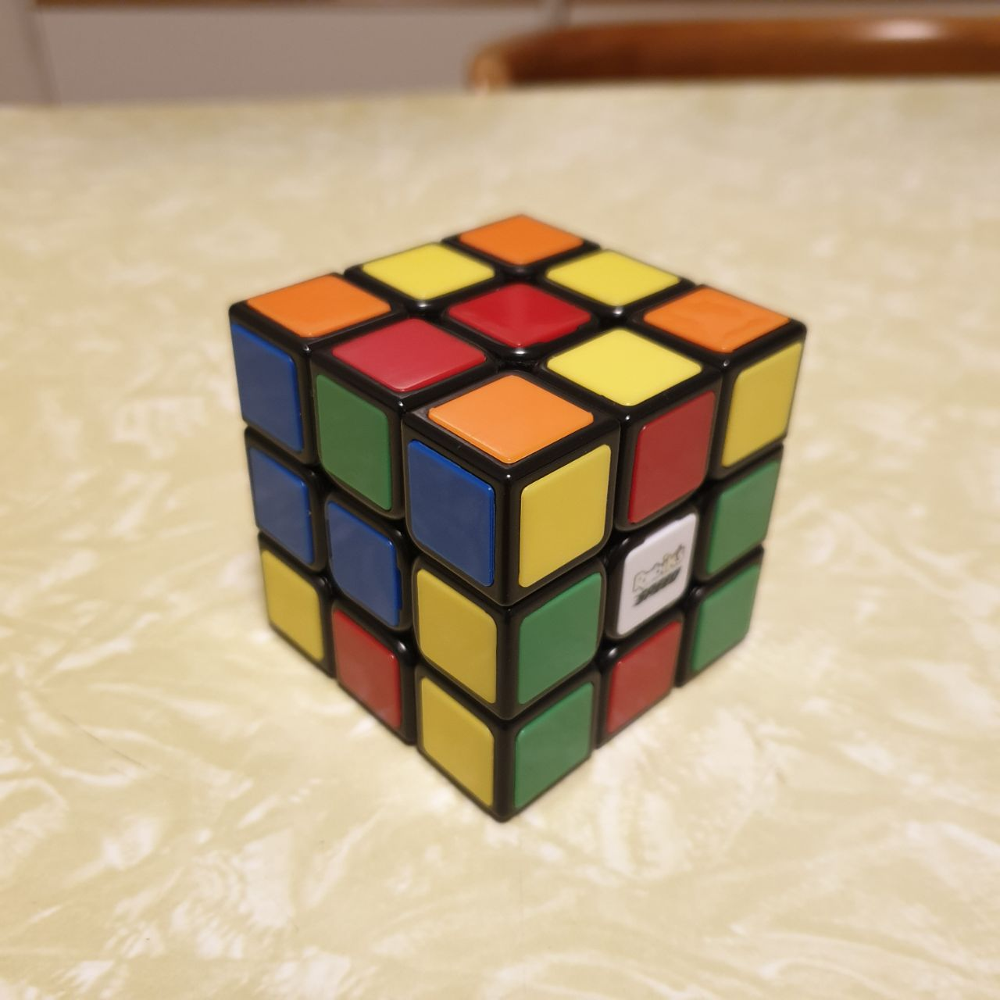

# Rubik's cube faces recognition
Automatic color detection of the faces of 3x3 rubik's cubes.

The project is implemented using Jupyter Notebooks (`ipynb`), so a recent installation of Python is required.

There are two versions of this project:
- `classic_cube.ipynb` works with standard rubik's cubes, e.g.:


- `borderless.ipynb` works with stickerless cubes, e.g.:


## Setting up the virtual environment

Create a python virtual environment:
```bash
python -m venv rubiks_cube_venv
```

Activate the virtual environment:
```bash
source rubiks_cube_venv/Scripts/activate # Windows
source rubiks_cube_venv/bin/activate # Linux/Mac
```

Install the required python modules:
```bash
pip install -r requirements.txt
```
VSCode is assumed to be the code editor of choice.

In VSCode, select the kernel you just created (see [here](https://code.visualstudio.com/docs/datascience/jupyter-notebooks#_create-or-open-a-jupyter-notebook) how to do it).
