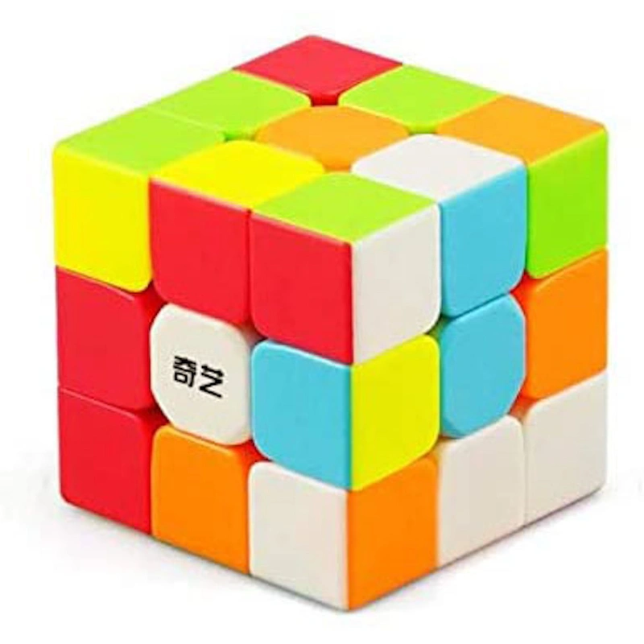

# Rubik's cube faces recognition
Automatic color detection of the faces of 3x3 rubik's cubes.

The project is implemented using Jupyter Notebooks (`ipynb`), so a recent installation of Python is required.

There are two versions of this project:
- `classic_cube.ipynb` works with standard rubik's cubes, e.g.:
Solarized dark             |  Solarized Ocean
<p float="left">
  
  
</p>  


- `borderless.ipynb` works with stickerless cubes, e.g.:


## Setting up the virtual environment

VSCode is assumed to be the code editor of choice.

### On Windows

Create a python virtual environment:
```bash
python -m venv rubiks_cube_venv
```

Activate the virtual environment:
```bash
source rubiks_cube_venv/Scripts/activate
```

Install the required python modules:
```bash
pip install -r requirements.txt
```


### On Linux
Install venv package for python:
```bash
sudo apt install python3-venv -y
```

Create a python virtual environment:
```bash
python3 -m venv rubiks_cube_venv
```

Activate the virtual environment:
```bash
source rubiks_cube_venv/bin/activate
```

Install the required python modules:
```bash
pip install -r requirements.txt
```

## Running the notebook

To execute the notebook:
- open it in VSCode
- select the kernel you just created (see [here](https://code.visualstudio.com/docs/datascience/jupyter-notebooks#_create-or-open-a-jupyter-notebook) how to do it)
- set the variable `path_to_image` to the path of the image you want to analyze
- run all the cells (see [here](https://code.visualstudio.com/docs/datascience/jupyter-notebooks#_running-cells) how to do it)

